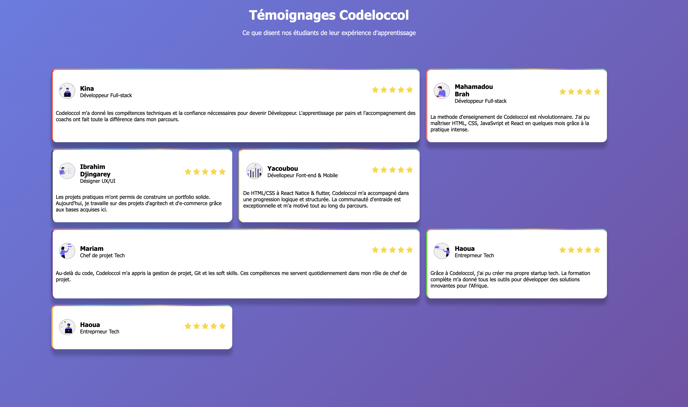

# Testimonial
## HTML
## CSS
- linear-gradient() : c'est pour mettre une couleur degradé
- Display: grid; : il permet de mieux structuré les élément sous forme du tableau et le ajusté facilement
- grid-template-columns: ...  : pour donné le nombre du colonne pour le conteneur(élément)
- grid-column: span n; : l'élément occupéra combien de colonne
- @keyframes nom{ ... } : elle permet de bien structuré une animation, definir les différent étape d'une animation qui prendra durant le temps

### Desktop

### Tablet

#### Mobile

